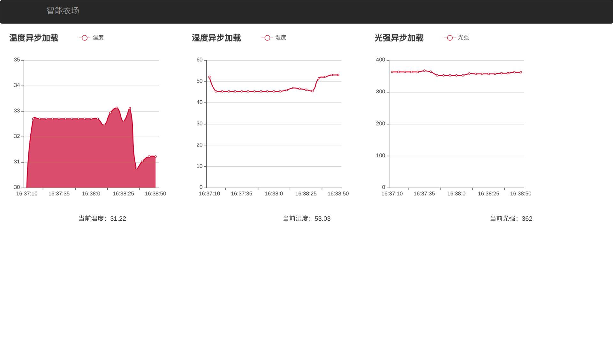

# iotFarmer


基于Echarts和bootstrap、温湿度、光照动态可视化

项目依赖：

```bash
pip3 install pyserial
```

使用方法：

1. 连接协调器、温湿度传感器、光强传感器、电机模块
2. Linux的话`sudo chmod 777 /dev/ttyUSB0`
3. 启动相应功能，如下：

```bash
python3 -m http.server //启动服务器，然后在浏览器打开http://0.0.0.0:8000/或者http://localhost:8000/
//启动新的控制台窗口
python3 design.py
```

数据库使用 sqlite3 ，可用 DB Browser 浏览数据库数据。

# 运行结果

